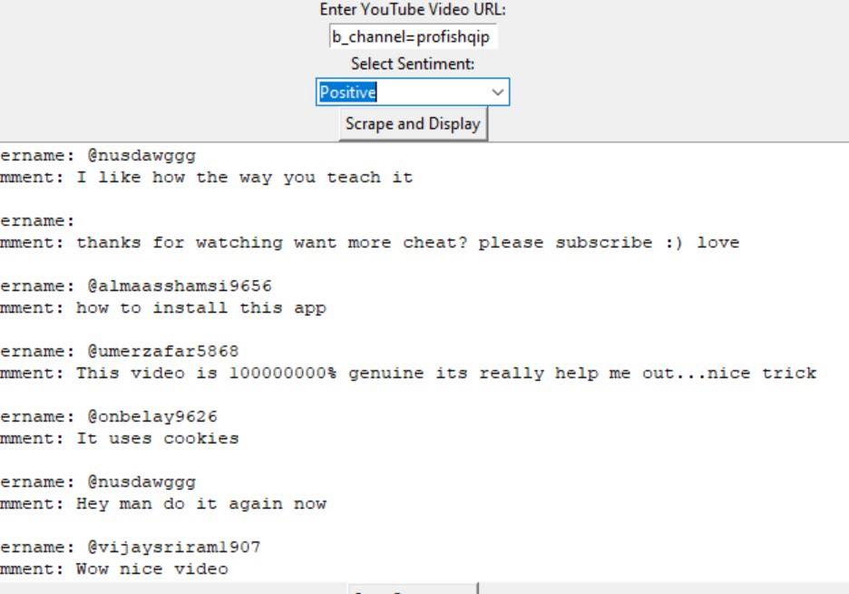

# YouTube Sentiment Pipeline

Analyze YouTube comments using a **multilingual BERT** model and a **Tkinter GUI**.



---

## Description

This project allows you to:

- Automatically scrape comments from a YouTube video.
- Analyze their **sentiment** (positive, negative, neutral) using the **BERT multilingual model** (`nlptown/bert-base-multilingual-uncased-sentiment`).
- Display results in a **Tkinter graphical interface**.
- Save filtered comments by sentiment to a `.txt` or `.csv` file.

---

## Features

- Scraping YouTube comments using **Selenium**.
- Sentiment analysis with **HuggingFace Transformers**.
- Simple and interactive **Tkinter GUI**.
- Filter comments by selected sentiment (positive / negative / neutral).
- Export results to a text file.

---

## Installation

1. Clone the repo:

```bash
git clone https://github.com/<your_username>/youtube-sentiment-pipeline.git
cd youtube-sentiment-pipeline
